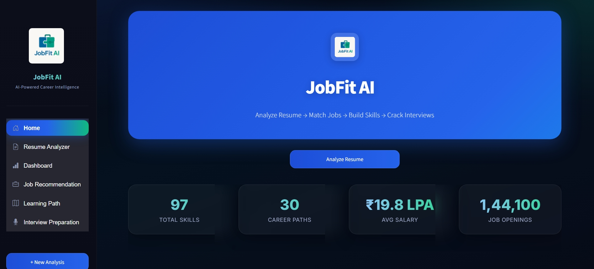
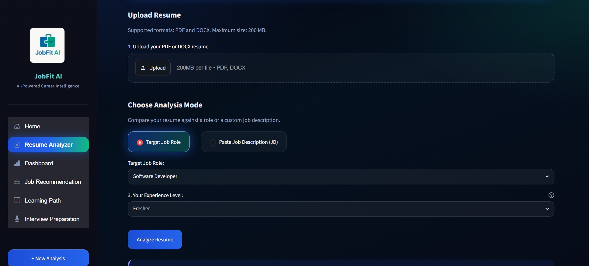
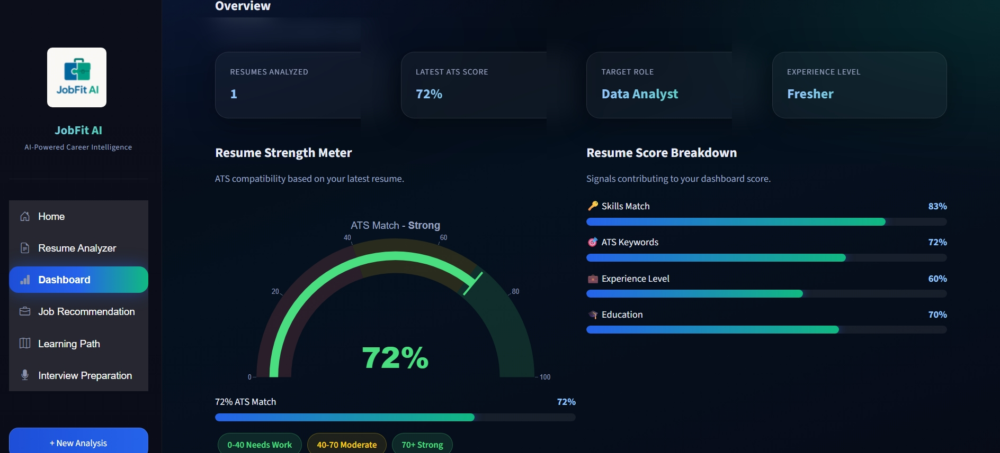
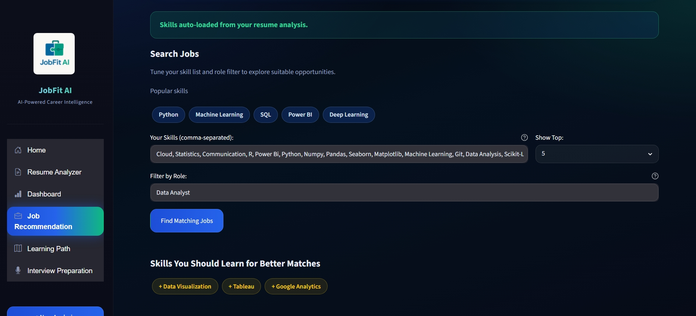
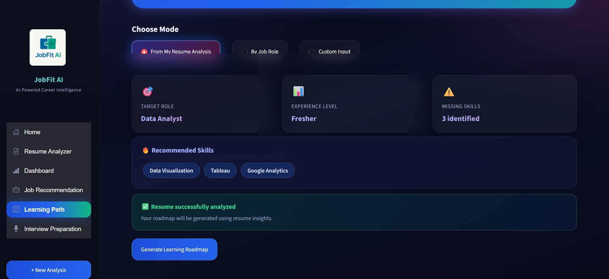
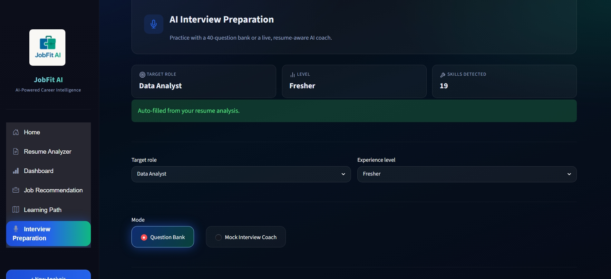

# JobFit AI — AI-Powered Resume Analysis & Job Recommendation System

> **Analyze your resume. Discover skill gaps. Get matched to jobs. Prepare for interviews — all in one place.**

[](https://www.python.org/)
[](https://streamlit.io/)
[](https://groq.com/)
[](LICENSE)

---

## 📋 Table of Contents

- [Overview](overview)
- [Key Features](key-features)
- [System Architecture](system-architecture)
- [Project Structure](project-structure)
- [Tech Stack](tech-stack)
- [Datasets](datasets)
- [Getting Started](getting-started)
- [Configuration](configuration)
- [Module Walkthrough](module-walkthrough)
- [How It Works](how-it-works)
- [Screenshots](screenshots)
- [Contributing](contributing)

---

## 🌟 Overview

**JobFit AI** is an end-to-end, AI-powered career intelligence platform built with **Streamlit**. It helps job seekers — from freshers to senior professionals — understand how well their resume matches a target role, discover which skills they are missing, find relevant job listings, and prepare for technical interviews — all driven by real 2026 job market data and a large language model (LLaMA 3.3 70B via Groq).

### Why JobFit AI?

| Problem | JobFit AI Solution |
|---|---|
| "Why did my resume get rejected?" | ATS Score with weighted must-have / nice-to-have skill breakdown |
| "Which skills should I learn next?" | Personalized 4-week learning roadmap from AI |
| "Which jobs match my profile?" | TF-IDF cosine similarity on 2026 market job data |
| "How do I prepare for interviews?" | AI-generated mock questions + answer evaluation |
| "What are career growth trends?" | Visual dashboard with salary, growth & demand data |

---

## ✨ Key Features

### 1. 📄 Resume Analyzer
- Upload a **PDF or DOCX** resume
- Automatically extract skills, projects, and experience level
- Get an **ATS Match Score** (0–100%) broken down by must-have (70%) and good-to-have (30%) skills
- See exactly which skills are **matched** vs **missing**
- Receive **AI-generated resume improvement suggestions** tailored to your role and experience level

### 2. 📊 Career Dashboard
- Visual overview of your resume analysis results
- Skill match progress bars
- Plotly-powered charts for ATS scores and skill coverage
- Persistent session state — no re-uploads needed across pages

### 3. 💼 Job Recommendation
- Matches your resume against **2026 India job market data**
- Uses **TF-IDF Cosine Similarity** for intelligent ranking
- Displays match score, matched skills, and missing skills per job listing
- Direct **apply links** (LinkedIn-powered)

### 4. 🗺️ Learning Path
- AI-generated **4-week roadmap** specific to your target role and experience level
- Adapts content for Fresher / Mid-Level / Senior candidates
- Focuses only on your **missing skills** — no generic advice
- Export roadmap as a **PDF**

### 5. 🎤 Interview Preparation
- Two modes:
  - **Quick Questions** — role-based question bank (Technical, Behavioral, HR, Situational)
  - **AI Mock Interview Coach** — interactive Q&A with project-based questions, AI evaluation of your answers, and a final performance report
- Exportable **PDF interview report**

### 6. 📈 Career Trends (Home Page)
- Industry growth rates, average salaries, and job openings by role
- Top emerging skills across the market
- Role-specific skill demand scores

---

## 🏗️ System Architecture

```
User Uploads Resume (PDF/DOCX)
          │
          ▼
   ┌─────────────┐
   │ PDF Parser  │  ──► Extract raw text
   └─────────────┘
          │
          ▼
   ┌──────────────────┐
   │  NLP Extractor   │  ──► Skills, Projects, Experience Level
   └──────────────────┘
          │
    ┌─────┴─────┐
    ▼           ▼
┌─────────┐  ┌───────────────────┐
│  Scorer │  │   Recommender     │
│(ATS     │  │(TF-IDF + Dataset) │
│ Score)  │  └───────────────────┘
└────┬────┘          │
     │               ▼
     │       ┌──────────────┐
     │       │  Job Listings │
     │       └──────────────┘
     │
     ▼
┌────────────────┐
│  Groq LLM API  │  (LLaMA 3.3-70B)
│  ai_suggestions│
└────────────────┘
     │
     ├──► Resume Improvement Suggestions
     ├──► 4-Week Learning Roadmap
     ├──► Interview Questions
     └──► Answer Evaluation & Final Report
```

---

## 📁 Project Structure

```
JobFit-AI/
│
├── app.py                        # 🚀 Main entry point — Streamlit app with sidebar navigation
│
├── views/                        # 📄 UI Pages (one file per page)
│   ├── home.py                   #    Home page — career trends & market insights
│   ├── analyzer.py               #    Resume Analyzer — upload, score, skill gap
│   ├── dashboard.py              #    Dashboard — visual summary of resume analysis
│   ├── career.py                 #    Job Recommendation — matched job listings
│   ├── learning.py               #    Learning Path — AI-generated 4-week roadmap
│   └── interview.py              #    Interview Preparation — mock Q&A with AI coach
│
├── utils/                        # 🔧 Backend Logic & Helpers
│   ├── pdf_parser.py             #    Extracts raw text from PDF / DOCX files
│   ├── nlp_extractor.py          #    Extracts skills & projects using spaCy + regex
│   ├── scorer.py                 #    ATS scoring — CSV-primary, TF-IDF fallback
│   ├── recommender.py            #    Job matching using TF-IDF cosine similarity
│   ├── ai_suggestions.py         #    All Groq LLM prompts & API calls
│   ├── coach_parsing.py          #    Parses AI coach responses into structured data
│   ├── coach_state.py            #    Manages mock interview session state
│   ├── pdf_export.py             #    Generates downloadable PDF reports
│   └── theme.py                  #    Custom CSS, UI components & design system
│
├── dataset/                      # 📊 Data Files
│   ├── jobs_2026_market_data.csv #    2026 India job listings with skills & salary
│   ├── role_skills_dataset.csv   #    Must-have & good-to-have skills per role
│   └── career_trends.csv         #    Growth rate, salary & job openings by role
│
├── .env.example                  # 🔑 Environment variable template
├── .gitignore
└── requirements.txt              # 📦 Python dependencies
```

---

## 🛠️ Tech Stack

| Category | Technology | Purpose |
|---|---|---|
| **Frontend / UI** | Streamlit | Web application framework |
| **Language** | Python 3.9+ | Core programming language |
| **LLM / AI** | Groq API + LLaMA 3.3-70B | Resume suggestions, roadmap, interview coaching |
| **NLP** | spaCy (`en_core_web_sm`) | Named entity recognition, text processing |
| **ML** | scikit-learn (TF-IDF, Cosine Similarity) | Job matching & scoring fallback |
| **Data** | Pandas, NumPy | Dataset loading, manipulation |
| **Charts** | Plotly | Interactive career trend visualizations |
| **PDF Parsing** | PyPDF2, pdfplumber | Resume text extraction |
| **DOCX Parsing** | python-docx | Word document text extraction |
| **PDF Export** | FPDF2, ReportLab | Downloadable report generation |
| **Styling** | Custom CSS (via theme.py) | Glassmorphism dark UI design |
| **Config** | python-dotenv | Environment variable management |

---

## 📊 Datasets

| File | Rows | Description |
|---|---|---|
| `jobs_2026_market_data.csv` | ~500+ | Real-world 2026 India job listings: title, location, key skills, salary, apply link |
| `role_skills_dataset.csv` | ~30 roles | Curated must-have and good-to-have skills per job role (used for weighted ATS scoring) |
| `career_trends.csv` | ~100+ | Growth rate, average salary (LPA), job openings, and skill demand scores by role |

---

## 🚀 Getting Started

### Prerequisites

- Python **3.9 or higher**
- A **Groq API Key** (free tier available at [groq.com](https://groq.com))
- `pip` package manager

### Step 1 — Clone the Repository

```bash
git clone https://github.com/your-username/JobFit-AI.git
cd JobFit-AI
```

### Step 2 — Create a Virtual Environment (Recommended)

```bash
python -m venv venv

# Windows
venv\Scripts\activate

# macOS / Linux
source venv/bin/activate
```

### Step 3 — Install Dependencies

```bash
pip install -r requirements.txt
```

### Step 4 — Download spaCy Language Model

```bash
python -m spacy download en_core_web_sm
```

### Step 5 — Configure Environment Variables

```bash
cp .env.example .env
```

Open `.env` and add your Groq API key:

```env
GROQ_API_KEY=your_groq_api_key_here
```

> **Get a free Groq API key** → [https://console.groq.com](https://console.groq.com)

### Step 6 — Run the Application

```bash
streamlit run app.py
```

The app will open at **`http://localhost:8501`** in your browser.

---

## ⚙️ Configuration

| Variable | File | Description |
|---|---|---|
| `GROQ_API_KEY` | `.env` | Required. Your Groq API key for LLM features |
| `MODEL` | `utils/ai_suggestions.py` | LLM model name (default: `llama-3.3-70b-versatile`) |
| `DATASET_PATH` | `utils/recommender.py` | Path to the jobs dataset CSV |
| `ROLE_SKILLS_PATH` | `utils/scorer.py` | Path to the role-skills CSV |

---

## 🔍 Module Walkthrough

### `utils/pdf_parser.py`
Accepts a Streamlit `UploadedFile` object. Uses **pdfplumber** for PDFs and **python-docx** for Word files to extract raw text. Returns a plain string.

### `utils/nlp_extractor.py`
- **`extract_skills(text)`** — Matches against a 100+ skill vocabulary using regex word-boundary matching. Covers programming languages, frameworks, cloud, DevOps, databases, ML tools, and soft skills.
- **`extract_projects(text)`** — Multi-pass parser that detects the "Projects" section, joins split lines, and filters out noise (dates, bullets, descriptions) to return clean project titles.

### `utils/scorer.py`
- **Primary path** — Looks up the target role in `role_skills_dataset.csv` with 3-level matching (exact → partial → word-overlap). Computes a **weighted ATS score**: must-have skills (70%) + good-to-have skills (30%).
- **Fallback path** — TF-IDF cosine similarity between resume skills and job description string.
- Results cached with `lru_cache` for performance.

### `utils/recommender.py`
- Loads `jobs_2026_market_data.csv` once with `@st.cache_data`.
- Vectorizes all job skill columns using **TF-IDF**.
- Transforms the resume skills string and computes **cosine similarity** scores against every job.
- Returns top N jobs with per-job match scores, matched skills, and missing skills.

### `utils/ai_suggestions.py`
All LLM interactions. Uses `groq` SDK with the `llama-3.3-70b-versatile` model.

| Function | What it does |
|---|---|
| `generate_resume_suggestions()` | 5-section resume improvement (skills, projects, summary, keywords, actions) |
| `generate_learning_path()` | 4-week structured roadmap with daily/weekly tasks |
| `generate_interview_questions()` | Role-specific question bank across 4 categories |
| `generate_coach_questions()` | Project-aware mock interview questions for AI coach |
| `evaluate_answer()` | Scores candidate's answer and gives structured feedback |
| `generate_final_report()` | Comprehensive interview performance summary |

### `utils/pdf_export.py`
Generates downloadable PDF reports (learning roadmaps, interview reports) using **FPDF2** / **ReportLab**.

---

## ⚙️ How It Works

```
1. User selects target role & experience level on the Resume Analyzer page
2. User uploads PDF or DOCX resume
3. pdf_parser extracts raw text
4. nlp_extractor identifies skills and projects from the text
5. scorer computes ATS score from role_skills_dataset.csv
6. Result is saved to st.session_state["latest_analysis"]
7. All other pages (Dashboard, Job Recommendation, Learning Path, Interview Prep)
   read from this shared session state — no re-upload needed
8. AI features (suggestions, roadmap, interview coaching) call Groq API on demand
```

**Session State Keys Used:**

| Key | Type | Set By | Used By |
|---|---|---|---|
| `latest_analysis` | `dict` | Resume Analyzer | Dashboard, Learning, Interview |
| `interview_questions` | `list` | Interview Prep | Interview Prep (Quick Mode) |
| `coach_state` | `dict` | AI Coach | AI Coach (mock interview session) |

---

## 📸 Screenshots

### 🏠 Home — Career Market Overview
> Real-time stats: 97 tracked skills, 30 career paths, ₹19.8 LPA avg salary, 1,44,100 job openings



---
### 📊 Resume Analyzer


---

### 📊 Dashboard — Resume Strength Meter
> ATS gauge chart with score breakdown across Skills Match (83%), ATS Keywords (72%), Experience Level (60%), and Education (70%)



---
### 💼 Job Recommendation — Skill-Based Job Search
> Skills auto-loaded from resume analysis. Editable skill list, role filter, and "Skills You Should Learn" gap suggestions



---

### 🗺️ Learning Path — AI Roadmap Generator
> Three modes: From Resume Analysis / By Job Role / Custom Input. Shows target role, experience level, missing skills, and generates a 4-week roadmap



---

### 🎤 Interview Preparation — AI Coach
> Auto-filled from resume. Choose between a 40-question bank or live Mock Interview Coach with AI-evaluated answers



---

## 🤝 Contributing

Contributions are welcome! To get started:

1. Fork the repository
2. Create a feature branch: `git checkout -b feature/your-feature-name`
3. Commit your changes: `git commit -m "feat: add your feature"`
4. Push to the branch: `git push origin feature/your-feature-name`
5. Open a Pull Request

### Areas Open for Contribution
- Add more roles to `role_skills_dataset.csv`
- Expand the jobs dataset with additional cities / domains
- Add LinkedIn / Naukri scraper for live job data
- Implement user authentication for saving history
- Add resume section completeness checker
- Multi-language resume support

---

## 📄 License

This project is licensed under the **MIT License** — see the [LICENSE](LICENSE) file for details.

---

## 🙏 Acknowledgements

- [Groq](https://groq.com/) — Ultra-fast LLM inference API
- [Meta LLaMA 3.3](https://ai.meta.com/llama/) — Open-source large language model
- [Streamlit](https://streamlit.io/) — Python web app framework
- [spaCy](https://spacy.io/) — Industrial-strength NLP library
- [scikit-learn](https://scikit-learn.org/) — ML utilities for TF-IDF & cosine similarity

---

<div align="center">
  <b>JobFit AI v1.0</b> — AI-Powered Career Intelligence<br>
  Built with ❤️ using Python & Streamlit
</div>
